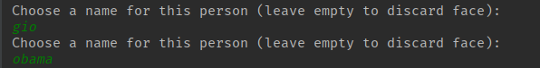
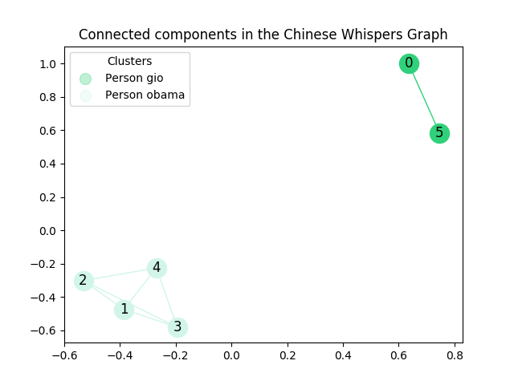
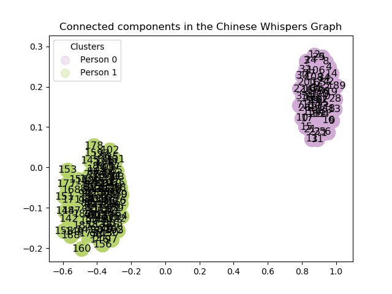
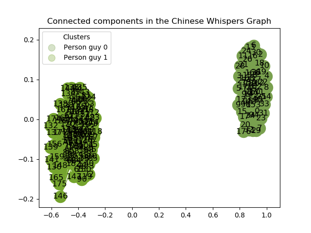
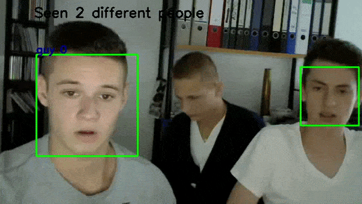
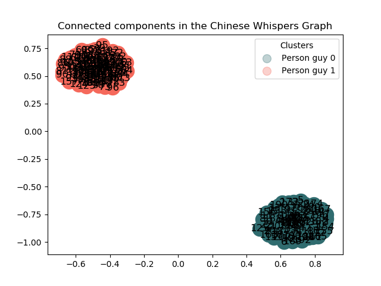

# README #

## Structure ##

+	`config.ini` : configuration file, required by [configparser](https://docs.python.org/3/library/configparser.html) contains these params:
	*	__confidence__ : float representing the confidence level for a face to be recognized. A face with a confidence score less than this parameter will not be considered for recognition (**default 8.**)
	*	__threshold__ : float representing the likelihood that two faces belong to the same person. Calculated as the [cosine distance](https://docs.scipy.org/doc/scipy-0.14.0/reference/generated/scipy.spatial.distance.cosine.html) between two output vectors from the CNN. (**default 0.35**)
	*	__vgg_path__ : relative (or absolute) path to the pre-trained CNN model file (default **None**)
	*	__haar_path__ : relative (or absolute) path to the pre-trained HAAR classifier (default **cwd**, cloned within this repository)
*	`arch.py` : CNN architecture ([VGG16](http://www.robots.ox.ac.uk/~vgg/research/very_deep/), taken from this [source](https://aboveintelligent.com/face-recognition-with-keras-and-opencv-2baf2a83b799))
*	`utils.py` : helper functions needed for config parsing and management, timing and handling [pickle](https://docs.python.org/3/library/pickle.html) files used to store previously tagged identities.
*	`identificator.py` : class defining the Identificator object, whom is delegated to detect and recognize the faces seen in the video.
*	`main.py`  

## Requirements ##

*	Python (>= 3.5)
*	Tensorflow
*	Keras
*	OpenCV
*	SciPy
*	NumPy
*	Pickle
*	Configparser

### Files needed :

*	__vgg_face.mat__ : (MATLAB) weights for a 16 layers deep CNN developed and trained by the Visual Geometry Group, as described in this [paper](https://arxiv.org/pdf/1409.1556.pdf). Download from [here](http://www.vlfeat.org/matconvnet/models/vgg-face.mat) or follow the instructions in the next section. 
*	__haarcascade_frontalface_default.xml__ : pre-trained (frontal) face detection feature-based classifier, stored as an XML file.

__TODO__ : generate requirements.txt file for conda/pip

## How to run ##

*	clone this repo : `git clone https://github.com/w00zie/face_recog`
*	run `main.py`
*	once asked for config profile, select `0 - DEFAULT`, if any file needed for the execution is missing it'll be downloaded

Two strings are shown on top of every frame :  

*	Seen {} different people -> Number of different people seen in this and all the previous sessions (if any). Actual number of different individuals that interacted with the camera.
*	Last seen/recognized : {} -> If there is no previous knowledge provided this string represents the last different person who've been recognized (new person 0, new person 1...), besides it displays the name of the previously-tagged person recognized.

# DEMOS #

## DEFAULT MODE ##

The _default mode_ is intended for machines that cannot handle a heavy load. Since running a `predict()` may result in a noticeable lag, this _workload-saving_ mode is a compromise between live recognition and mere detection.
Identities are displayed on top of every frame, pointing out the last detected/recognized person.

*	First we ran `main.py` with our `default` configuration. No previous knowledge provided.  

*	Once 2 new people were detected, we were shown their faces...  
   

... and we've been asked to insert their relative names to tag these newly detected identities.  

*	The graph generated by the labelled clusters:

*	On the next execution the previously labelled people are now recognized and tagged.  

## PERFORMANCE MODE ##

The main structure is the same as the _default mode_, however it is intended for machines that can handle the heavier load of making many more predicts per frame. Identities, in fact, are predicted and displayed over every face present in every frame.  

*	We ran `main.py` with our `performance default` config. No previous knowledge provided.  

  

*	We were shown the graph every 100 nodes. You can notice a predict error near the end of the previous gif, fixed by an automatic run of the [Chinese Whispers algorith](https://en.wikipedia.org/wiki/Chinese_Whispers_(clustering_method))

*	Then we were asked to insert the names relative to the detected faces, named *guy_0* and *guy_1* respectively.  

  
  
  

*	On the next execution the previously labelled people are now recognized and tagged.  

  

*	Enriching the clusters in the graph prediction after prediction

 

[video credit](https://www.youtube.com/watch?v=xHGtlVFi2VI)
